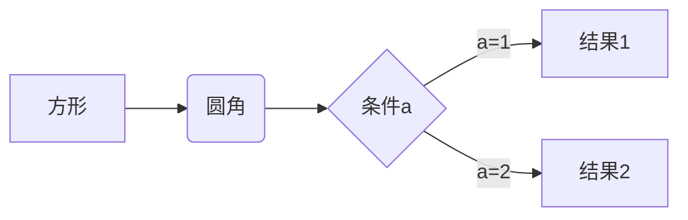
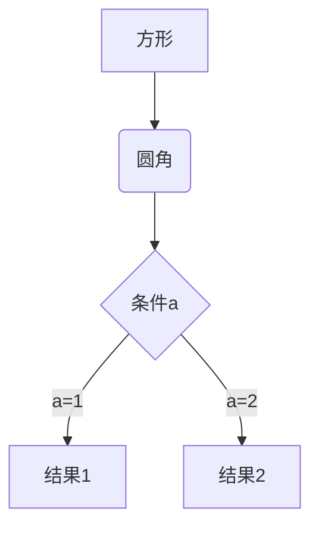
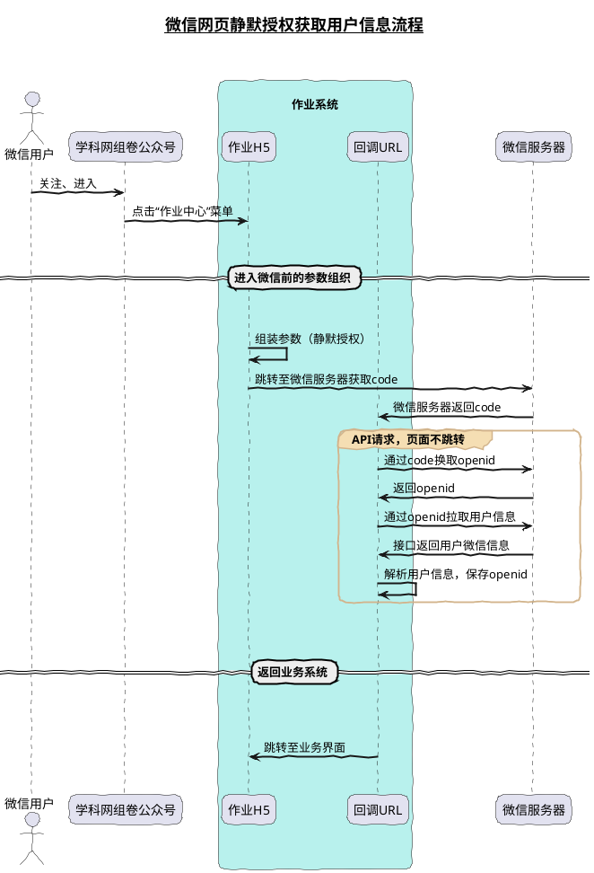
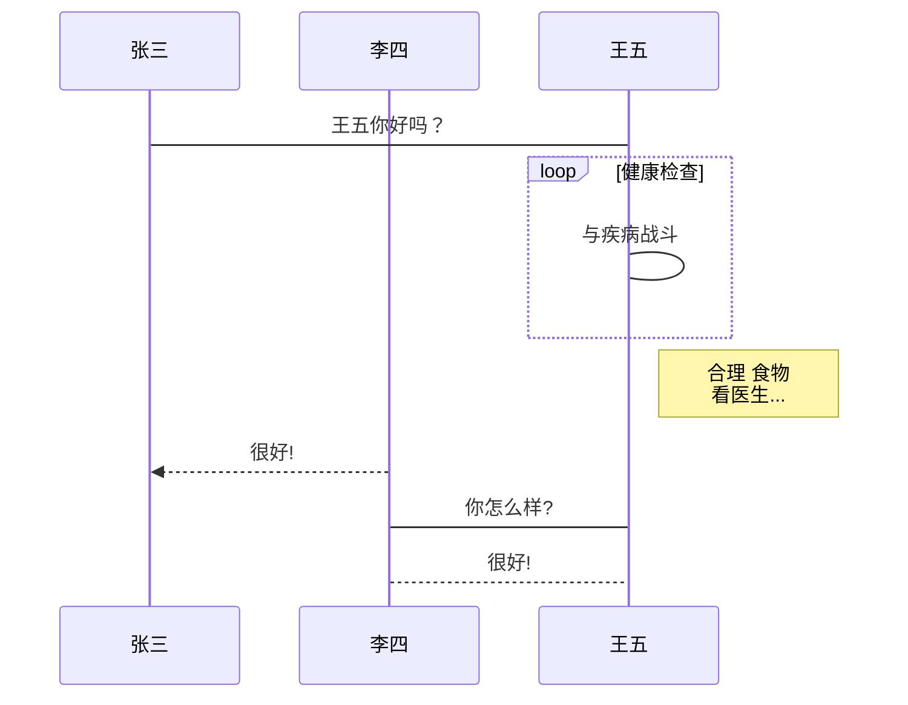
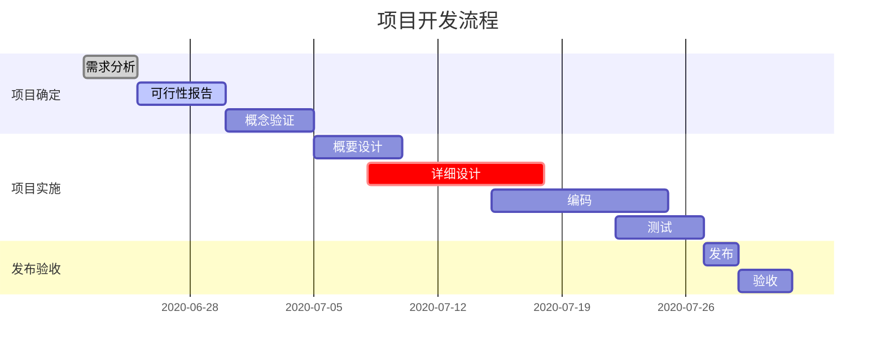
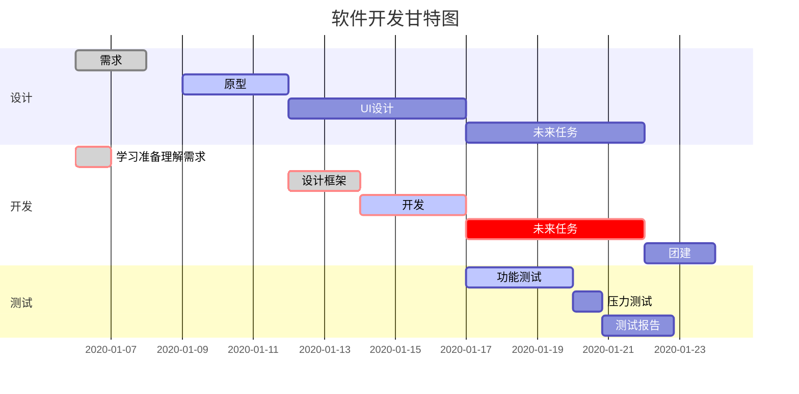

---
tags:
  - markdown
---

# Markdown 入门 

> 从现在开始，只有 `.md`

## 什么是 Markdown

Markdown是一种轻量级标记语言，创始人为约翰·格鲁伯（英语：John Gruber）。它允许人们使用易读易写的纯文本格式编写文档，然后转换成有效的XHTML（或者HTML）文档。这种语言吸收了很多在电子邮件中已有的纯文本标记的特性。

由于Markdown的轻量化、易读易写特性，并且对于图片，图表、数学式都有支持，目前许多网站都广泛使用Markdown来撰写帮助文档或是用于论坛上发表消息。如GitHub、Reddit、Diaspora、Stack Exchange、OpenStreetMap 、SourceForge、简书等，甚至还能被使用来撰写电子书，如：Gitbook。

## Markdown 常用语法

### 标题

```markdown
# 一级标题
## 二级标题
### 三级标题
#### 四级标题
##### 五级标题
###### 六级标题
```

### 段落与字体

#### 段落
Markdown 没有特殊的格式，换行是使用两个以上空格加上回车。***建议多敲几个回车解决段落问题！***

#### 字体

```markdown

*斜体文本*
_斜体文本_

**粗体文本**
__粗体文本__

***粗斜体文本***
___粗斜体文本___

~~删除线文本~~

```

~~删除线文本~~


### 列表

#### 无序列表

无序列表使用星号(`*`)、加号(`+`)或是减号(`-`)作为列表标记

```markdown
* 第一项
* 第二项
* 第三项

+ 第一项
+ 第二项
+ 第三项


- 第一项
- 第二项
- 第三项
```

- 第一项
- 第二项
- 第三项

#### 有序列表

有序列表使用数字并加上 `.` 号来表示。*小技巧：数字会自动排列*

```markdown
1. 第一项
1. 第二项
1. 第三项
```

1. 第一项
1. 第二项
1. 第三项

#### 列表嵌套

```markdown
1. 第一项
    - 第一项嵌套的第一个元素
    - 第一项嵌套的第二个元素
1. 第二项
    - 第二项嵌套的第一个元素
    - 第二项嵌套的第二个元素
        - 第二项嵌套的第二个元素的子元素
```

1. 第一项
    - 第一项嵌套的第一个元素
    - 第一项嵌套的第二个元素
1. 第二项
    - 第二项嵌套的第一个元素
    - 第二项嵌套的第二个元素
        - 第二项嵌套的第二个元素的子元素

### 引用

#### 普通引用
```markdown
> 这是一个引用
```

> 这是一个引用

#### 嵌套引用

```markdown
> 这是一个引用
>> 这是一个嵌套引用
```

> 这是一个引用
>> 这是一个嵌套引用

#### 引用与列表的组合

```markdown
> 区块中使用列表
> 1. 第一项
> 2. 第二项
> + 第一项
> + 第二项
> + 第三项
```

> 区块中使用列表
> 
> 1. 第一项
> 2. 第二项
> + 第一项
> + 第二项
> + 第三项

```markdown
- 第一项
  > 第一项的引用
  > 第一项的引用
- 第二项
  > 第二项的引用
```

- 第一项
  > 第一项的引用
  > 第一项的引用
- 第二项
  > 第二项的引用

### 链接与图片

```markdown
[链接名称](链接地址)

或者

<链接地址>

图片


```

[组卷网](http://zujuan.xkw.com/)

<http://zujuan.xkw.com/>


### 表格
```markdown
| 居中对齐 | 左对齐 | 右对齐 |
| :----:| :----- | ----: |
| 单元格 | 单元格 | 单元格 |
| 单元格 | 单元格 | 单元格 |
```

| 居中对齐 | 左对齐 | 右对齐 |
| :----:| :----- | -----: |
| 单元格单元格 | 单元格单元格 | 单元格单元格 |
| 单元格 | 单元格 | 单元格 |

### 代码

#### 单行代码

```markdown
`code`
```

`code`

#### 代码块

```csharp
public void foo() {
    Console.WriteLine("hello world");
}
```

```java
public void foo() {
    System.out.println("hello world");
}
```

## Markdown 进阶

### 支持的 HTML 元素

目前支持的 HTML 元素有：`<kbd> <b> <i> <em> <sup> <sub> <br>`等 ，如：

```markdown
使用 <kbd>Ctrl</kbd>+<kbd>Alt</kbd>+<kbd>Del</kbd> 重启电脑
```

使用 <kbd>Ctrl</kbd>+<kbd>Alt</kbd>+<kbd>Del</kbd> 重启电脑

```markdown
上<sup>标</sup> 和 下<sub>标</sub>
```

使用 上<sup>标</sup> 和 下<sub>标</sub>

### 任务列表 <small>需要解释器支持</small>

```markdown
- [ ] 待完成任务
- [x] 已完成任务
```

- [ ] 待完成任务
- [x] 已完成任务

### 数学公式 <small>需要解释器支持</small>
```latex
$$
\mathbf{V}_1 \times \mathbf{V}_2 =  \begin{vmatrix} 
\mathbf{i} & \mathbf{j} & \mathbf{k} \\
\frac{\partial X}{\partial u} &  \frac{\partial Y}{\partial u} & 0 \\
\frac{\partial X}{\partial v} &  \frac{\partial Y}{\partial v} & 0 \\
\end{vmatrix}
$$
```

$$
\mathbf{V}_1 \times \mathbf{V}_2 =  \begin{vmatrix} 
\mathbf{i} & \mathbf{j} & \mathbf{k} \\
\frac{\partial X}{\partial u} &  \frac{\partial Y}{\partial u} & 0 \\
\frac{\partial X}{\partial v} &  \frac{\partial Y}{\partial v} & 0 \\
\end{vmatrix}
$$

### 奇技淫巧 <small>需要解释器支持</small>

#### 标准流程图

```flow
st=>start: 开始框
op=>operation: 处理框
cond=>condition: 判断框(是或否?)
sub1=>subroutine: 子流程
io=>inputoutput: 输入输出框
e=>end: 结束框
st->op->cond
cond(yes)->io->e
cond(no)->sub1(right)->op
```

---

#### 标准流程图（横向）

```flow
st=>start: 开始框
op=>operation: 处理框
cond=>condition: 判断框(是或否?)
sub1=>subroutine: 子流程
io=>inputoutput: 输入输出框
e=>end: 结束框
st(right)->op(right)->cond
cond(yes)->io(bottom)->e
cond(no)->sub1(right)->op
```

---

#### mermaid 横向流程图



---

#### mermaid 竖向流程图



---

#### plantuml 时序图



---

#### mermaid 时序图



---

#### mermaid 甘特图



---



#### 参考资料

- [PlantUML 官方中文站点](https://plantuml.com/zh/)
- [mermaid 官方文档（英文）](https://mermaid-js.github.io/mermaid/)
- [基于 Mermaid 的时序图、流程图和甘特图（中文）](https://www.iminho.me/wiki/docs/mindoc/mermaid.md)

## 善其事，利其器

- 懒人玩法
    - [typora 编辑器：书写、预览、导出基本都满足](https://typora.io/)
- 基础玩法
    - [Visual Studio Code（VS Code）：文档书写工具](###Visual-Studio-Code)
    - [Markdown Preview Enhanced：VS Code的插件，预览文档](###Markdown-Preview-Enhanced)
- 高级玩法
    - [Pandoc：格式转换的「瑞士军刀」](###Pandoc)
    - [LaTeX：基于ΤΕΧ的排版系统](###LaTeX)
    - [PlantUML：开源的UML快速绘制工具](###PlantUML)
    - [ImageMagick：开源图片处理工具](###ImageMagick)

### Visual Studio Code

微软出品的跨平台编辑器，开源免费，功能强大。目前所使用过的最好用的 markdown 书写工具。

下载地址：https://code.visualstudio.com/


### Markdown Preview Enhanced

Markdown Preview Enhanced 是一款为 Atom 以及 Visual Studio Code 编辑器编写的超级强大的 Markdown 插件。 这款插件意在让你拥有飘逸的 Markdown 写作体验。


安装方法 

打开 vscode 编辑器，在插件页搜索 markdown-preview-enhanced，接着点击 Install 按钮。


### Pandoc

Pandoc 是由John MacFarlane开发的标记语言转换工具，可实现不同标记语言间的格式转换，堪称该领域中的“瑞士军刀”。

官方网站：http://pandoc.org/

下载安装，并没有需要特别注意的地方。安装完成后，在命令行输入如下代码，检查安装是否成功。

```bash
 pandoc -v
```

若要使用 pandoc 导出 PDF 文档的话，就必须使用 LaTeX 。


### LaTeX

摘自维基百科

> LaTeX， 是一种基于TEX的排版系统，由美国电脑学家莱斯利·兰伯特在20世纪80年代初期开发，利用这种格式，即使用户没有排版和程序设计的知识也可以充分发挥由TEX所提供的强大功能，能在几天，甚至几小时内生成很多具有书籍质量的印刷品。对于生成复杂表格和数学公式，这一点表现得尤为突出。因此它非常适用于生成高印刷质量的科技和数学类文档。这个系统同样适用于生成从简单的信件到完整书籍的所有其他种类的文档。

Pandoc 推荐在 windows 下使用 [MikTex](https://miktex.org/)，但 TexLive 对环境的配置则更加傻瓜。不过 MikTex 现在只有基础安装版，所需要的宏包都要自行安装，而且安装源都是国外的，不是很稳定（俄罗斯的源貌似还可以），TexLive 安装完需要约 5G 的磁盘空间。

[miktex清华大学开源软件镜像站](https://mirrors.tuna.tsinghua.edu.cn/CTAN/systems/win32/miktex/setup/)

[texlive清华大学开源软件镜像站](https://mirrors.tuna.tsinghua.edu.cn/CTAN/systems/texlive/Images/)

#### MiKTeX 中文支持的解决方案

以管理员身份启动 MiKTeX Console，切换到 Packages 面板，搜索并安装下列 Packages（宏包）

- ctex
- l3kernel
- l3packages
- ms
- cjk
- cjkpunct
- miktex-cjkutils （若系统没自动安装，就给装上）
- ulem
- zhnumber
- zhmetrics


### PlantUML

轻松从简单的文字说明创建UML图。也有许多种可用的图表。它也可以在PNG, LaTeX, EPS, SVG图像导出。

打开 vscode 编辑器，在插件页搜索 PlantUML，接着点击 Install 按钮。

#### PlantUML插件依赖环境

- 安装 `Java` 环境
- 安装 `GraphViz` 程序 [下载](http://www.graphviz.org/download/)
  - 将 `GraphViz` 可执行程序路径（bin目录）配置到 `$path`
  - 添加环境变量 `$GRAPHVIZ_DOT`（bin目录下的dot.exe程序）
- 安装 `PlantUML` 插件（alt+D预览图片）


### ImageMagick

ImageMagick是一个免费的创建、编辑、合成图片的软件。它可以读取、转换、写入多种格式的图片。图片切割、颜色替换、各种效果的应用，图片的旋转、组合，文本，直线，多边形，椭圆，曲线，附加到图片伸展旋转。ImageMagick是免费软件：全部源码开放，可以自由使用，复制，修改，发布，它遵守GPL许可协议，可以运行于大多数的操作系统，ImageMagick的大多数功能的使用都来源于命令行工具。

[ImageMagick 下载](http://www.imagemagick.org/script/download.php)

<i class="fa fa-apple"></i> mac系统推荐使用 Homebrew 进行安装

```bash
brew install imagemagick
```


## 使用 Markdown + git 建立自己的知识库

### 源文件

**<i class="fa fa-angellist"></i> 直接上干货**

1. 安装 `git`
2. 安装 `Visual Studio Code`
3. 安装 `Markdown Preview Enhanced`
4. 找一个支持 `git` 的站点，推荐 <https://gitee.com/>
5. 建立自己的账号和项目（可公开，可私有）
6. 克隆项目到本地
7. 编写自己的文档
8. push文档到服务器（Visual Studio Code 自带管理工具）
9. 完毕

### 发布

#### <i class="fa fa-file-pdf-o"></i> 生成 PDF

##### 包教包会方式

利用 `Markdown Preview Enhanced` 的在浏览器中打开功能，在 <i class="fa fa-chrome"></i> `Chrome` 中预览，然后用 `Chrome` 的打印功能生成 PDF

##### 氪肝方式

使用在 `善其事，利其器` 章节中，高级玩法介绍的工具，可以生成非常专业的 PDF 文档。

#### <i class="fa fa-wordpress"></i> 生成 Blog
<https://gitee.com/help/articles/4136>
