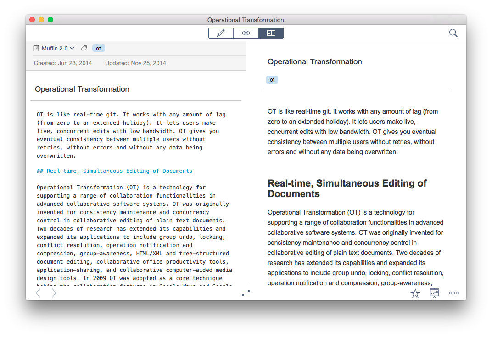
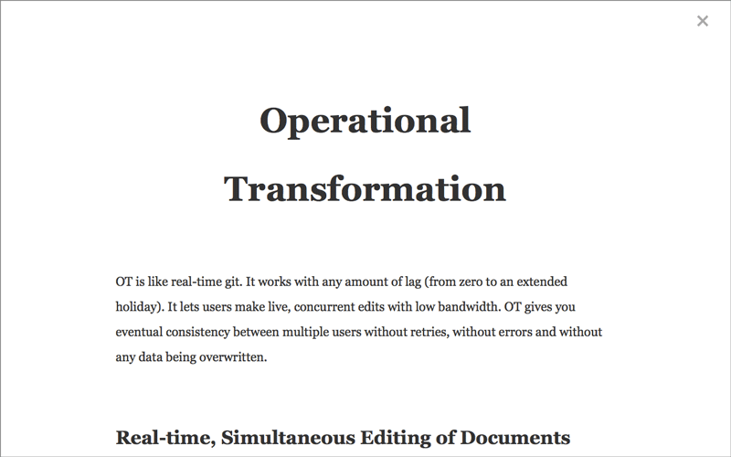

# 预览和演示模式

## 即时预览

Quiver 支持 Markdown 和 LaTeX 的即时预览。你可以切换到同时显示编辑器和预览的双栏模式 (⌘6)。

你也可以双击列表中的笔记在新窗口打开，然后切换到双栏模式。例如：

当您在编辑器中进行更改时，预览会实时更新。

默认情况下，编辑器和预览之间会同步滚动。但您可以在视图菜单中关闭此功能。

## 演示模式

Quiver 还支持全屏幕演示模式。您可以从“笔记”菜单中选择“启动演示”(⌃⌥⌘P)，或单击笔记右下角的“演示”按钮。

演示模式非常适合教室使用、 团队会议、 演示或者自己复习笔记。

在演示模式中，你可以使用左/右箭头键来移动到列表中的上个/下个笔记。