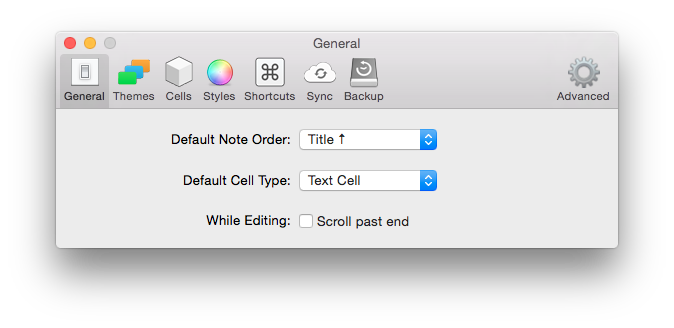
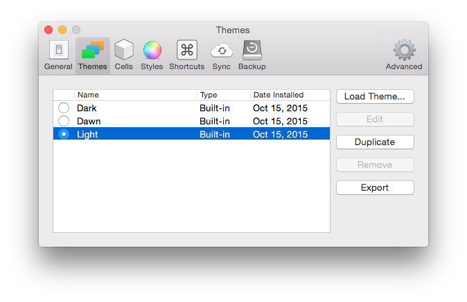
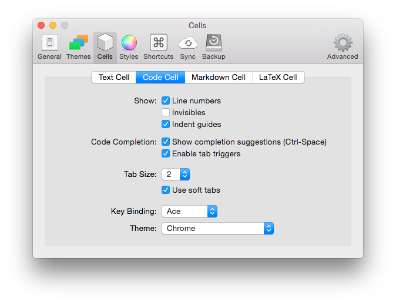
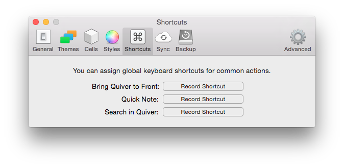

# 首选项

在常规设置页，您可以更改默认的笔记列表排序、 默认单元格类型等。

在主题设置页，您可以管理界面的主题。Quiver 附带了几个设计精美的主题，包括一个浅色主题和一个深色主题。你也可以自己设计主题。

在单元格设置页，您可以显示/隐藏行号，启用代码自动补全、 更改键绑定，创建整个应用程序范围的 LaTeX 自定义宏等。

在样式设置页，您可以给编辑器、 预览、 演示、 导出的 HTML 或 PDF 设置自定义样式。支持的所有标准的 CSS 规则，如字体大小、 文本颜色、 背景颜色等。

在快捷方式设置页，您可以设置几个系统键盘快捷方式: 将 Quiver 窗口移前、 创建新笔记，和搜索笔记。

同步设置页和备份设置页前面已讲过了。

在高级设置页，您可以将您的设置和自定义 CSS 导出成一个 JSON 文件。这样你可以轻松地在另一台电脑上加载同样的设置。

